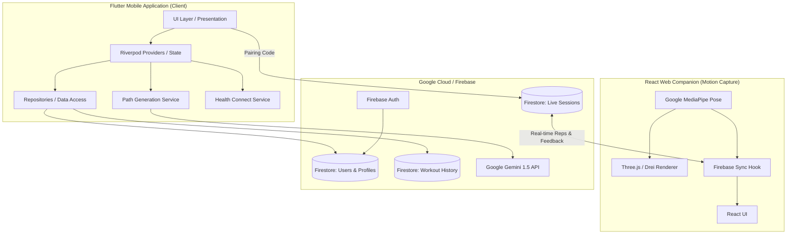

# BloomFit Architecture & Technical Documentation

## 1. System Overview
BloomFit is a next-generation fitness tracking ecosystem comprised of a **Flutter mobile application** (the core hub) and a **React-based Web Companion** (for real-time motion capture). Both platforms communicate synchronously through a centralized **Firebase/Firestore backend**.

The system is built on modern, scalable architectural principles using **Riverpod** for state management, **Gemini 3 Flash** for dynamic AI plan generation, and **MediaPipe** for localized, privacy-first skeletal tracking.

---

## 2. High-Level Architecture Diagram

---

## 3. Core Modules & Technologies

### 3.1. The Flutter Mobile App
*   **Framework:** Flutter (Dart)
*   **State Management:** `flutter_riverpod` - Ensures highly decoupled business logic and reactive UI updates.
*   **Local 3D Rendering:** `model_viewer_plus` - Renders complex `.glb` character animations natively without network latency.
*   **Health Integration:** `health` package - securely syncs with Android Health Connect to read daily steps and active calories.
*   **AI Integration:** `google_generative_ai` - Connects to Gemini 3 Flash to generate personalized, non-linear "Workout Journeys" based on user goals, experience, and past performance.

### 3.2. The React Web Companion (mocap-web)
*   **Framework:** React (TypeScript), Vite.
*   **Motion Tracking:** `@mediapipe/tasks-vision` - Processes webcam feeds entirely client-side using machine learning to map 33 3D skeletal landmarks at 30+ FPS.
*   **3D Visualization:** `three`, `@react-three/fiber`, `@react-three/drei` - Maps MediaPipe landmarks to a visible skeleton and renders 3D coaching models alongside the user.
*   **Real-time Database:** `firebase/firestore` - Acts as the bridging layer between the phone and laptop with near-zero latency.

---

## 4. Key Workflows

### 4.1. AI "Journey" Generation
1.  User inputs their goal (e.g., "Weight Loss") and experience level.
2.  The `PathGenerationService` compiles a prompt containing the user's details and recent workout history/skip reasons.
3.  Gemini returns a highly structured JSON array representing a multi-day progression path.
4.  The app parses the JSON and generates interactive nodes on a vertical timeline.

### 4.2. The Workout Engine (Circuit Flow)
The mobile app uses a flattened "Circuit" architecture for workout execution:
1.  `ActiveWorkoutSession` parses `WorkoutActivity` objects (e.g., Squats: 3 sets).
2.  It flattens these into individual `_WorkoutStep` objects.
3.  The UI presents exactly one set per screen to reduce clutter.
4.  Users progress linearly or circularly depending on the generated step order.

### 4.3. Web Companion Sync (Mocap)
1.  **Handshake:** The web app generates a random 4-digit code and creates a document in the `live_sessions` Firestore collection.
2.  **Connection:** The user types the code into the mobile app. The mobile app begins writing the current exercise name, target reps, and text instructions to that document.
3.  **Execution:** The user performs the exercise in front of their laptop. MediaPipe analyzes joint angles (e.g., knee angle < 90° for a squat) to count reps and generate form feedback.
4.  **Feedback Loop:** The web app writes the `currentReps` and `formFeedback` back to the Firestore document. The mobile app listens to this stream and updates its UI instantly.

---

## 5. Database Schema (Firestore)

### `users/{userId}`
*   `displayName`, `email`, `level`, `xp`, `streak`, `primaryGoal`, `experienceLevel`
*   **Subcollection: `history`**
    *   `workoutName`, `durationSeconds`, `accuracy` (0-100), `date`
    *   `exercises`: Array of objects detailing reps/sets completed and skipped status.
*   **Subcollection: `paths`**
    *   Stores the AI-generated JSON journey nodes.
*   **Subcollection: `custom_workouts`**
    *   Stores user-crafted workouts.

### `live_sessions/{sessionCode}`
*   `status` (active/idle)
*   `exerciseName`, `instructions` (Array of Strings)
*   `targetReps`
*   `currentReps`
*   `formFeedback` (e.g., "Go lower!", "Perfect")
*   `timestamp`
